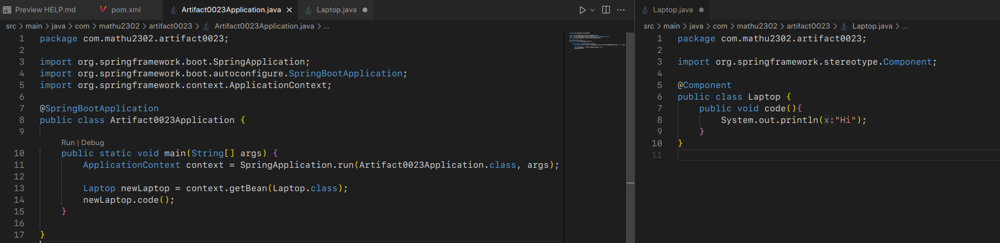

- **Notes of the day**
  id:: 6792f1ec-e83a-493a-b0e9-cb88df70e26c
	- *In traditional programming, an object is responsible for creating or finding its own dependencies. With **Inversion of Control (IoC)**, this responsibility is reversed: a framework (like Spring) takes control of creating objects and managing their dependencies. **Dependency Injection (DI)**is the method Spring uses to achieve this. Instead of an object creating its own dependencies, the Spring IoC container provides(injects) them. This makes the code more modular, testable, and easier to maintain.*
		- The framework (Spring) takes control of  the creation, injection, and lifecycle of beans through **Dependency Injection (DI)** and the **IoC container**. This approach allows developers to focus on **business logic** instead of worrying about object creation and dependency management.
		- You define **how** this is done through configuration (XML, annotations, or Java config).
			- {:height 176, :width 689}
			- *The object is create when the run time, then it is getting through container methods and it is injected and used.*
		- The container **calls** the necessary methods or constructors to inject dependencies at runtime.
		- This approach allows developers to focus on **business logic** instead of worrying about object creation and dependency management.
- **Actions of the day**
	- Building solution
	- Building Projects: Final touch in The Quiz project
	- Tutorial and recaps: completing the Spring relevancy and xml.
- **Reflect of the day**
	- I have a dream of Spring boot. Where I can see, the objects those are created and the reference are displayed., and accessed without any unease.
	-