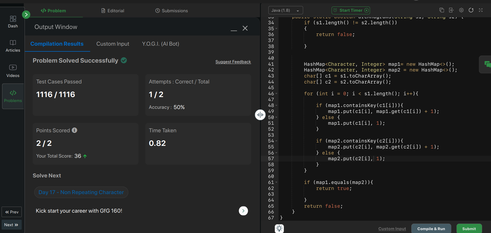

- Notes of the day:
	- LinkedIn gitHub post
		- Learnt Modularity, Advance java, streams, Object Oriented Programming, File Handling, Streams and SO called things
- Actions of the day:
	- DONE Solving Problems: ==**Completed "1" Problem**==
		- 
		-
	- DONE Creating Projects: Normal multiplication (04 - 05: 30) in Session,
	  :LOGBOOK:
	  CLOCK: [2025-02-04 Tue 21:55:03]--[2025-02-04 Tue 21:55:04] =>  00:00:01
	  :END:
		-
		-
- Reflect of the day:
	- I'm feeling the overwhelmed and dumped at the same time. It is until you move to Do project on it and Apply it. Focus on the real effort and action (How small steps and do it.) You can do it. ----> 05:05
	- Complete it. Assign work for you on it. Done it. Revise them.
	- Actually Doing the Work Public provide you the guard and security. [[What is want to to be "me"?]] #action