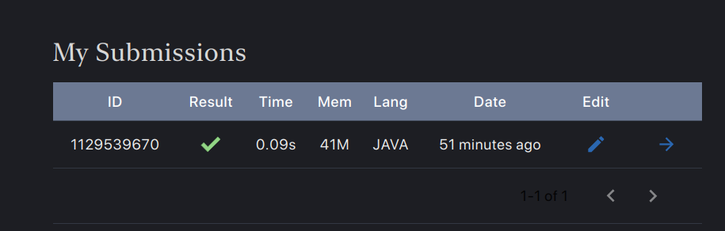
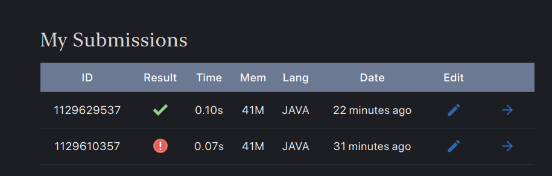

- Actions of The day:
	- Solving Problems: ==**Completed 2 problems **==
	  collapsed:: true
		- 
		- 
		-
	- **Building Solution**:
	- DONE Creating solution for complete the model error
		- [[Fixing JSTL Not Working in Spring Boot 3+ (JSP Pages)]]
	- DONE LinkedIn Post
	- What about an Habit tracker? using Spring web.
	-
- Thoughts of the day:
	- Focus on the result and Journey in parallel to Optimize The Effort.
	- Write the assumption in the Learning, the Problem and the main Arguments [[SCHEMA: The Process of learning]] #[[How to start Learning]]
	-
- Notes of the day
	- The more you determined, the easier and faster the result.
- sometimes making tough decision need to be done. In order to preserve your willpower
	- 