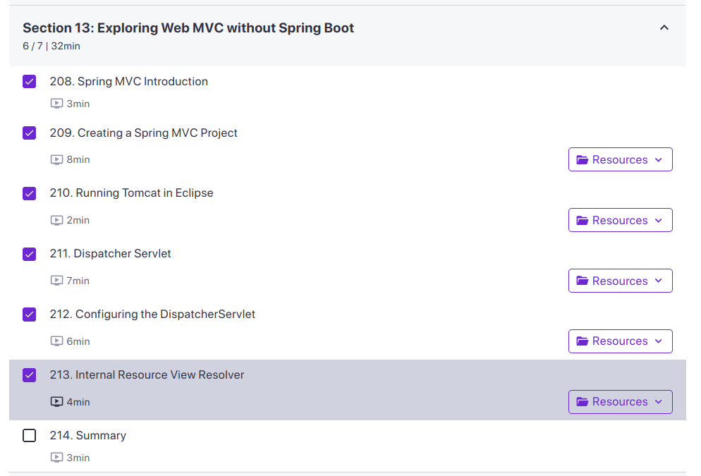

- Actions of the day:
	- [[Solving Problems]] :
	- Building Solutions:
		- 
- Reflect of the day:
- Notes of the day:
	- What not to do, and reflect on your vision daily to frame the Lil plan [[What is want to to be "me"?]] #success #action
	- Summarize actively by questions and find the patterns from that THE BIG PICTURE (like MVC). And Repetition on  Big picture [[How to start Learning]]
- Thoughts of the day:
	- There is no one perfect here, scam and it is kinda faking the value provision. Just concentrate your journey and value your efforts and actions. enough. All the best.
	- This is because the placement in campus, just about the count of solved problems. lil of aptitude and the communication is the final effort.
	- Focus on the vision and the efforts. and talking about your stuff or show is not wrong., it is motivating others too. and BE THE LEADER, INSPIRE OTHERS.
	-