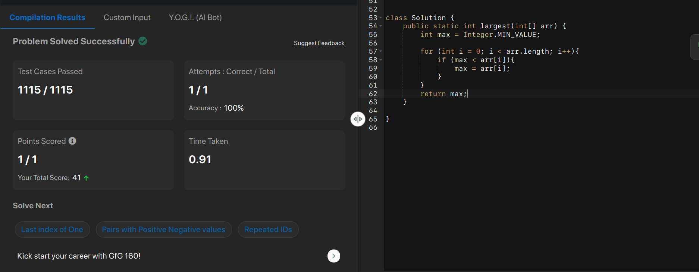
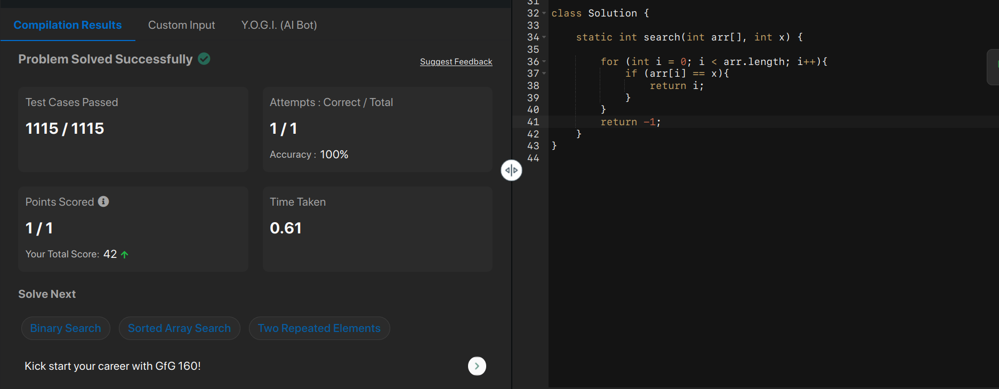
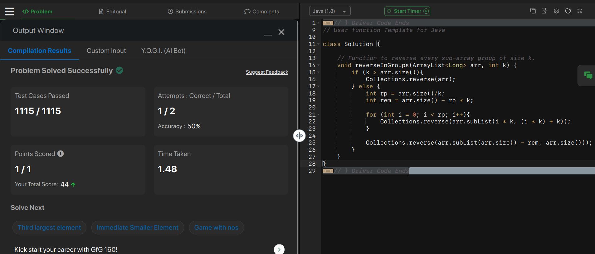
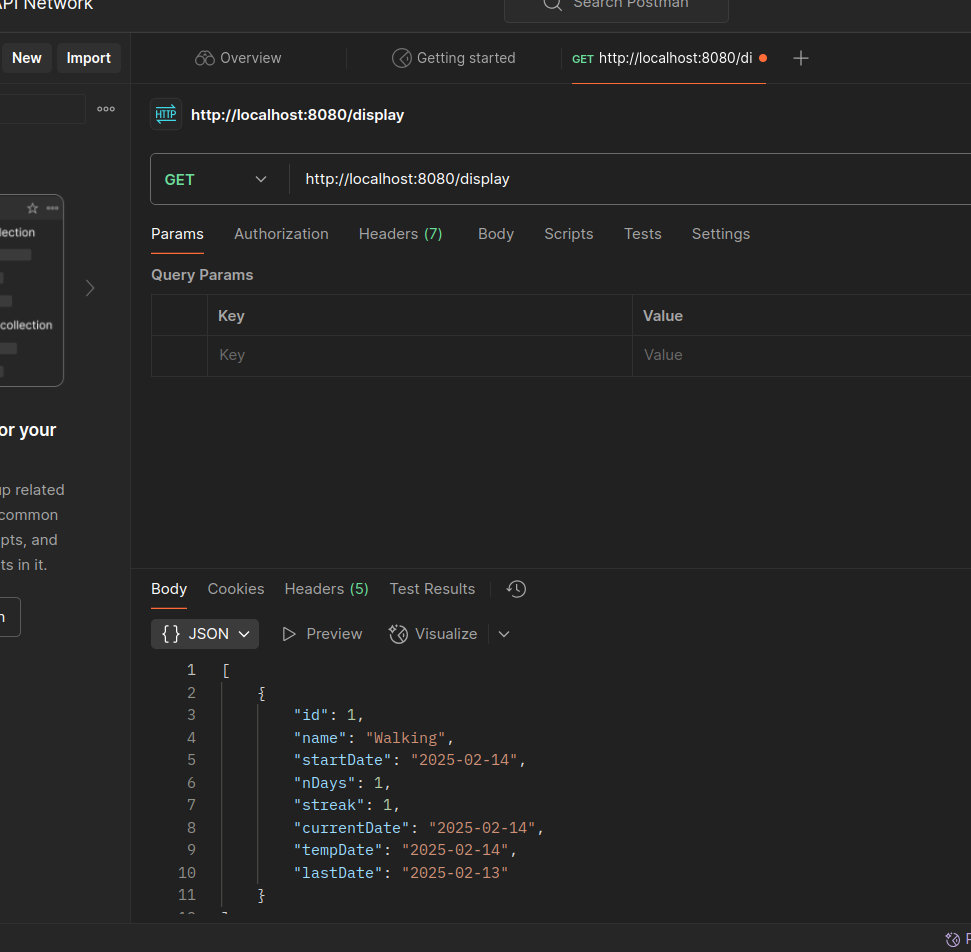
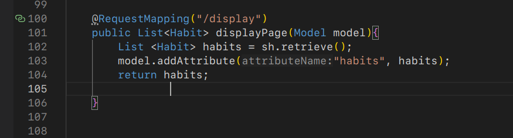

- Actions of the day:
	- Building solution:
		- 
		- always edge cases first, think from the small case then build up [[cp lessons]]
		- 
		- Satisfied with this, because I planned and crafted
			- {:height 263, :width 595}
			-
	- Building Project:
		- add two things in the RestController
			- The RestController 
			  logseq.order-list-type:: number
			- The return type in the method and the return
			  logseq.order-list-type:: number
			- 
			  logseq.order-list-type:: number
			- 
			  logseq.order-list-type:: number
			- logseq.order-list-type:: number
	- Completing tutorials:
- notes of the dayy:
	- [[Queue operations]]
	-