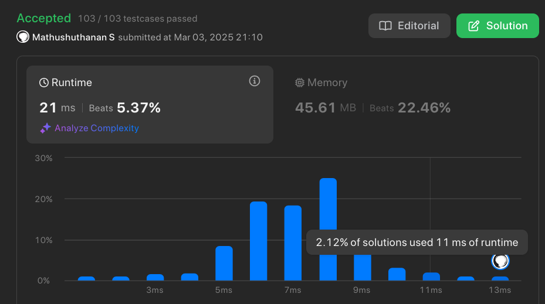

- Quality thoughts of the day:
	- The Process on working: Just Mindful on Effortful Actions and Who you what to be. Ready to Embrace anything. #[[What is want to to be "me"?]]
	- How can I apply them on
		- Thoughts of what others think? *Simply Careless about what others think? It is about to work hard and not detach on the results. Work on what is need to be Created (the solution, the learning on DSA & working, Learning soft skills) rather not to hold on & expecting some result to get satisfaction.* ==Kinda like Focus to hard work on the daily Actions for our vision to achieve and forget about the real outcome.== 
		  
		  Reference:  [The Deletion on Fear of Failure]({{video https://youtu.be/BJ2NvjS7Aio}}).
		- The reason that every effortful steps that don't satisfy me, the reason - I'm depended on some  outcome. So let that go, just focus on Taking actions, building solutions, Building Projects for your Vision. Be thoughtful on Who you want to be rather on results.
		-
- Actions of the day:
	- Building Solution:
	  collapsed:: true
		- 
	- Building Project:
	-