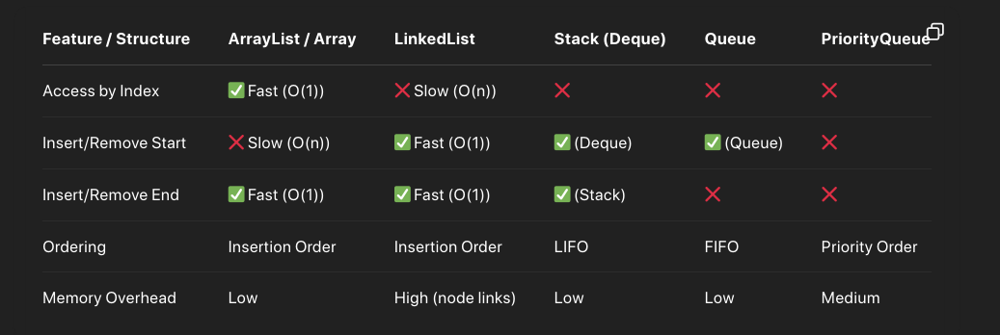

- level by level -- inclusion and exclusion
	- if upper **lesser than** cost -- prune
	- if max is lesser than weight_i -- prune.
- [`weigth_i`: 0, total] --> incl and excl
	- when the `weight_i` is greater then total -- prune.
	- if `weight_i` and `curr_total` is smaller than total -- prune
	- *note: consider the `curr_total` always subt with its level even incl/excl*
- [[Chronicles: Collaborative Storytelling Platform]] #areas
- 
-
-