- [[DSA Patterns]]
	- Prefix sum : Sum of Elements in a subarray
	  collapsed:: true
		- prefix sum the array
		- e.g. Prefix sum Model problem: `sum[i, j] = P[j] - P[i - 1]`
		- 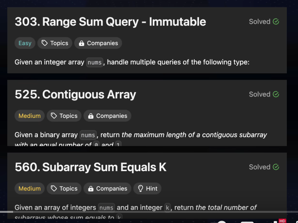
	- Two Pointers: Move the `i` & `j` to solve
	  collapsed:: true
		- 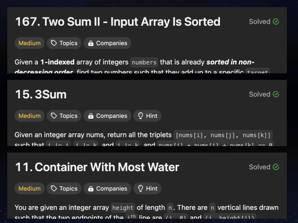
	- Sliding window: to find a subarray / substring that meet a specific criteria
	  collapsed:: true
		- 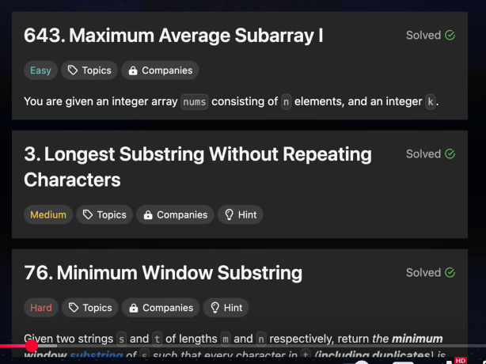
		-
	- Fast and slow pointers: Finding cycles, mid in linkedlist & arrays
	  collapsed:: true
		- 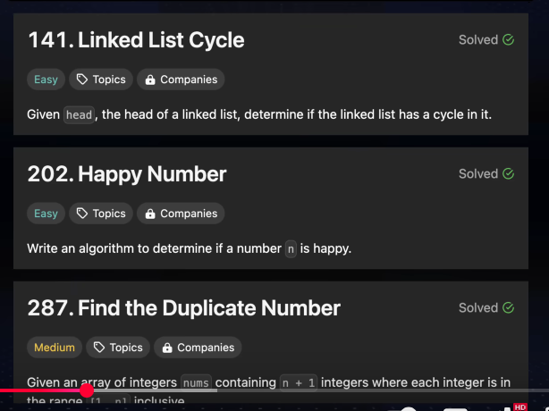
	- Linked List In-place Reversal:  2 or 3 pointers and structure the pointer. To rearrage the list.
	  collapsed:: true
		- 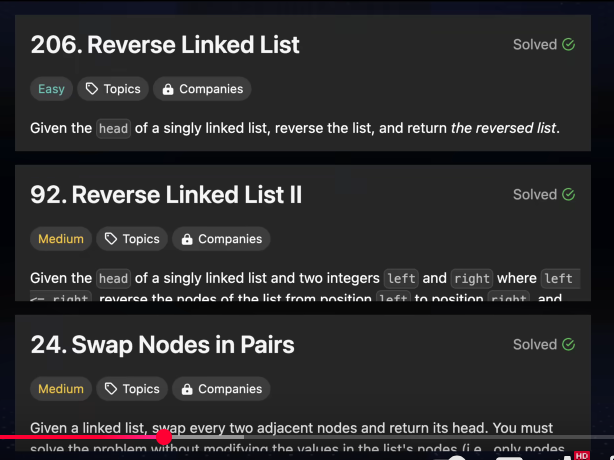
	- Monotonic stack: stack use to find the next greater / next smaller element.
	  collapsed:: true
		- 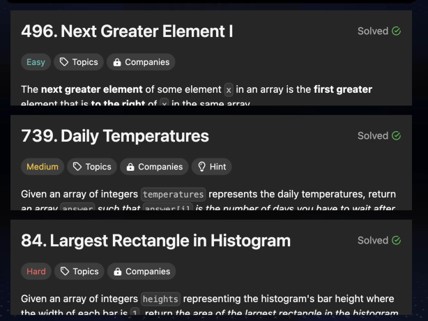
	- Top `K` elements: `k` largest, smallest or most frequent elements to be found. (**min heap**)
	  collapsed:: true
		- k largest - use min heap
		- k smallest - use max heap
		- Quick select adv
		- 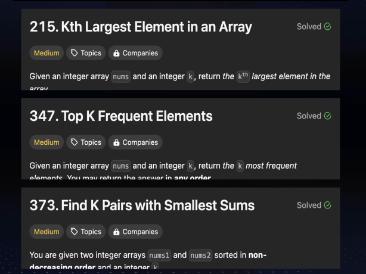
	- Overlapping intervals: Interval or ranges overlap (merging interval, intersection, insert)
	  collapsed:: true
		- 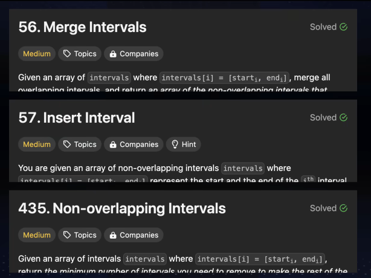
		-
	- Modified Binary Search:
	  collapsed:: true
		- 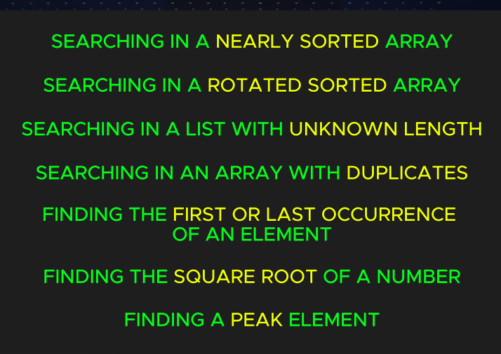
		-
		- 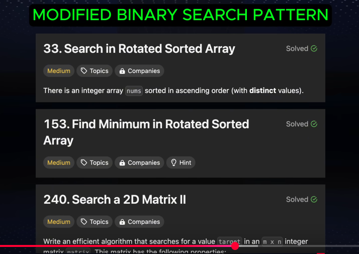
		-
	- Binary Tree Traversal:  in-order, pre, post, level about to traversal:
	  collapsed:: true
		- 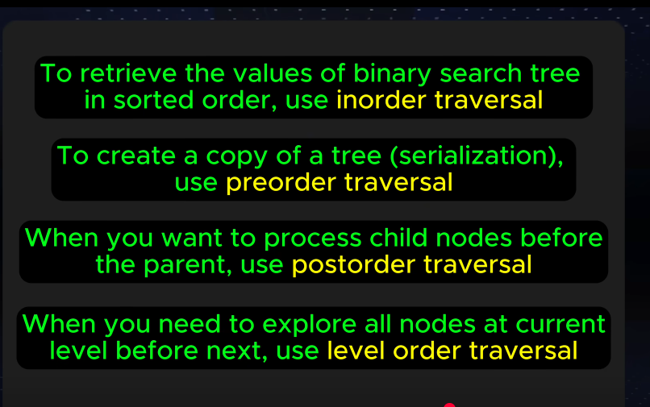
		- 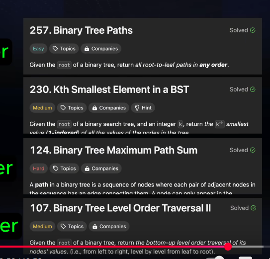
		-
	- DFS;
	  collapsed:: true
		- ### used in
		- Finding a path between two nodes
		- Checking if a graph contains a cycles
		- Finding a topological order of DAG
		- counting the number of connected components
		- 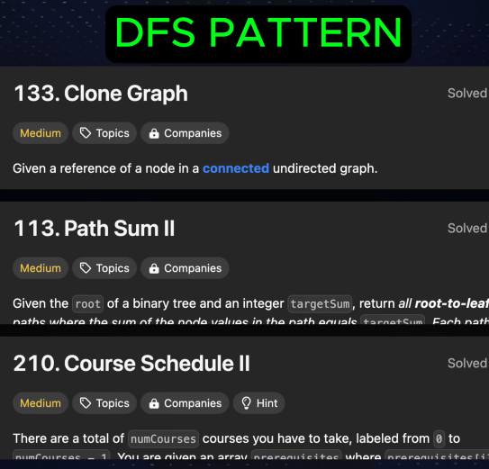
	- BFS:
	  collapsed:: true
		- finding the shortest path between nodes
		- Printing all nodes by level
		- Finding all connected component in a graph
		- Finding the shortest transformation sequence from one word to other
		- 
	- Matrix Traversal: can use the dfs & bfs
	  collapsed:: true
		- Finding the shortest path in a grid
		- 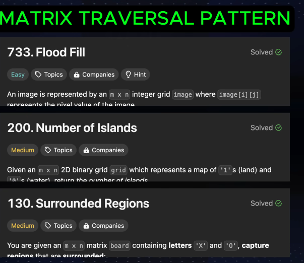
		-
	- Backtracking: exploring all potential solutions
	  collapsed:: true
		- Generate permutation & combinations
		- solve puzzle: sukudo & n-queen
		- possible paths from start to end in a graph or maze
		- valid parenthesis of a given
		- 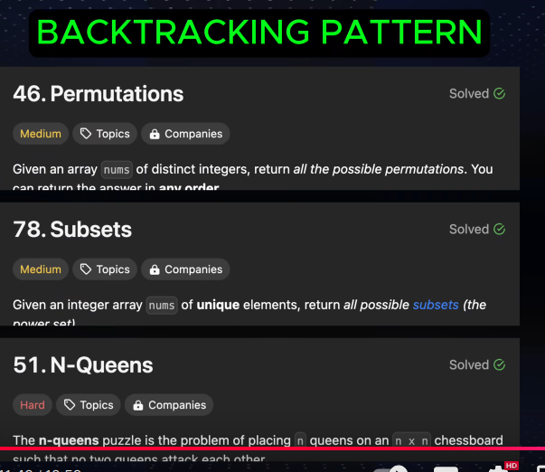
	- Dynamic Programming: breaking to smaller problems and storing the solution to avoid repetition
	  collapsed:: true
		- Overlapping subproblems
		- Optimal substructure (max or min a certain value)
		- count the number of ways to achieve a goal
		- patterns in dp
		  collapsed:: true
			- fib
			- 0/1 knapsack
			- Longest common Subsequence
			- Longest Increasing Subsequence
			- Subset sum
			- Matrix sum multiplication
			- 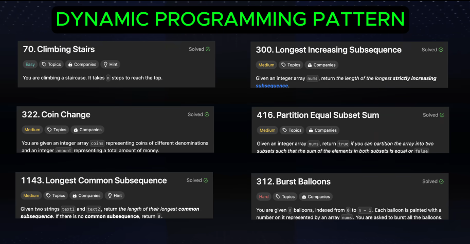
	- Resources: [Algo Master - 15 patterns](https://blog.algomaster.io/p/15-leetcode-patterns)
-
-
- ### For  *each data structure*  (Array, LL, Stack, Queue, Tree, etc):
  🔁 For every operation:
- `Insert / Add`
- `Delete / Remove`
- `Access / Get`
- `Modify / Update`
- `Search / Compare`
- `Convert to/from another DS`
  
  Do:
- 🧠 **Understand what it means** (just 1 line) and it's Time Complexity
- 🛠️ **Implement it once yourself**
- 🧪 **2-3 LeetCode practice problems only using that DS**
-