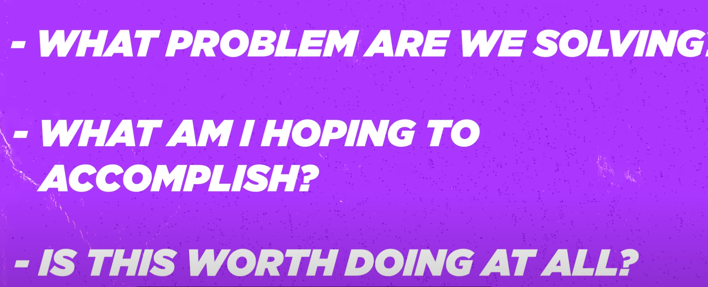

- Daily Template
  id:: 68299df5-784b-4e32-b38b-8917e409ad32
  template:: Daily Template
  template-including-parent:: false
	- Reflection
	  id:: 68299dfc-96d5-4bd5-80bd-3f8293cb7de3
		- Have I definite the Today's Goal on Top Priorities and those of Close to ?
			- Solving Problem: Learn/Practice/Review
			- Push one task in Creating Solution
			- Peace Mind + Mission 555
		- Today:
			- If today were the last day of my life, would I want to do what I am about to do Today?(Yes/NO)
			- **Am I prioritizing today’s time for the right, effortful actions?**
	- **Captures and Notes**
	  id:: 6829a04b-6f8a-4092-880b-8a387508f494
		-
- **Reflection**
	- **If today were the last day of my life, would I want to do what I am about to do Today?**
	- **What actions that I'll do if the day is restored from the Morning 4 AM?**
	- **What have you achieved today? and others**
	- **Top Priorities**
		- DONE Problem solving (Learn/Practice/Review)
		-
		- Mission 555 + Peace Mind
	- collapsed:: true
	  
	  **Mood:**
		- On a scale of 1-10, how was my overall mood today?
			- [Rating]
		- What influenced my mood?
			- [Factors affecting mood]
	- **Gratitude:**
		- List three things I'm grateful for today.
			- [Gratitude 1]
			- [Gratitude 2]
			- [Gratitude 3]
- **Captures and Notes**
	- [[Everything starts with "Why"]]
	- [The People whom need in your life - alux]({{video https://youtu.be/KTtUuw2DnCU}}) #[[What is want to to be "me"?]]
		- Smart people are broke - this statement hits me, coz I've been trail myself and facing situations and being slow in the progress. I'm thinking of me as I can Achieve. but the true thing, you need a mentor to get guidance and do stuff.
		- Providing value and Consistency on to get unbeatable right people
	- [Alex Hormozi - 13 lessons]({{video https://youtu.be/cq8GyLrEuAk}})
		- Assuming that you're dumber than every else. You make better decisions and learn more. Not talk much, just open to listen up more.
		- The Hardest Response to earn is one's OWN
		- If you want to control what people think, Control what they say.  the words you use.
		- Try to change the Behaviour from reading worth old books. else it's waste of time. (like how to influence friends and people)
		- Great people lack something that you have. Singular focus on one thing and say no to everything else.
		- Good Will Compounds faster than Money
		- You're going to dieAll
		- Extraordinary accomplishments done when Ordinary Things comes from doing for Extraordinary Periods of time. (Basics) which is through **Commitment to it not the action itself**
		- If it's worth doing, then it is worth doing well
		  collapsed:: true
			- 
		- negotiate everything except for the  values
		- Humility: you gain status by giving more to the group then you get.
		- Sad person have only 1 wish: they want to feel better to cover the one wish to be not sad. they do stuff. Looking for the deficiency of current me and the future, look for the doing things, making progress and feeling proud and iterate. #restart. And Do not paralysed, the people don't think about you anyway.
		- Failure leads to learning. Learning Leads to Success. Success leads to Complacency. Complacency leads to Failure
		- Truth real for me, successful have accurate view on world then you do. Get the EGO HAT OFF and learn from anyone in the world., that how they really that efficient.
	- Intelligent Imitation
		- Steve Jobs
		- Jeff Bezzos
		- Joma Tech
		- Alex Hormozi
		- Dan Koe
	- Weekly Reflection Template
	  template:: Weekly Reflection
	  template-including-parent:: false
	  collapsed:: true
	  **Week of:** [Insert week dates, e.g., May 12 - May 18, 2025]
		- collapsed:: true
		  
		  **Week in Review:**
			- **How would my life change if I executed my thoughts?**
				- [Impact of action]
			- **Where do I want to be in five years (2030)?**
				- [Vision for career, skills, life]
			- **Are my plans just words, or am I acting?**
				- [Assess action vs. inaction]
			- **How did I stay consistent over streaks?**
				- [Examples of steady progress]
		- collapsed:: true
		  
		  **Goal Progress:**
			- What were my goals for this week?
				- [List goals]
			- Did I achieve them? If not, why?
				- [Yes/No and explanation]
		- collapsed:: true
		  
		  **Challenges and Solutions:**
			- What was the biggest challenge this week?
				- [Describe challenge]
			- How did I handle it?
				- [Describe solution or approach]
		- collapsed:: true
		  
		  **Habits and Routines:**
			- Which habits did I maintain consistently?
				- [List habits]
			- Which habits did I struggle with? Why?
				- [List habits and reasons]
		- collapsed:: true
		  
		  **Learning and Growth:**
			- What new thing did I learn this week?
				- [Describe learning]
			- How can this help me in the future?
				- [Explain application]
		- collapsed:: true
		  
		  **Relationships:**
			- Did I spend quality time with important people?
				- [Yes/No and details]
			- Any conflicts or positive interactions to note?
				- [Describe]
		- collapsed:: true
		  
		  **Self-Care:**
			- Did I take care of my physical and mental health?
				- [Yes/No and details]
			- Areas to improve next week:
				- [List areas]
		- collapsed:: true
		  
		  **Reflection on Identity:**
			- Am I living according to my values?
				- [Yes/No and explanation]
			- Actions I'm proud of:
				- [List actions]
			- Actions I regret:
				- [List actions]
		- collapsed:: true
		  
		  **Planning for Next Week:**
			- What are my top three goals for the coming week?
				- [Goal 1]
				- [Goal 2]
				- [Goal 3]
	- TOC:
		- Neso Academy,
	- [[Algorithms Captures]]
		- [Fulkerson - approach]({{video https://youtu.be/7Li2TgTpmmg}})
		- [Knap sack - state space]({{video https://www.youtube.com/watch?v=PXIgB4pA0F4&pp=ygUna25hcHNhY2sgcHJvYmxlbSB1c2luZyBzdGF0ZSBzcGFjZSB0cmVl}})
		- [hamiltonian - backtracking]({{video https://www.youtube.com/watch?v=vD-rgQ0re9Q}})
		- [TSP - chapter 4]({{video https://youtu.be/4keo-upf1zk}})
		- [Assignment Problems - Chapter 04]({{video https://youtu.be/BDAYDPlqYx4}})
		-
	-