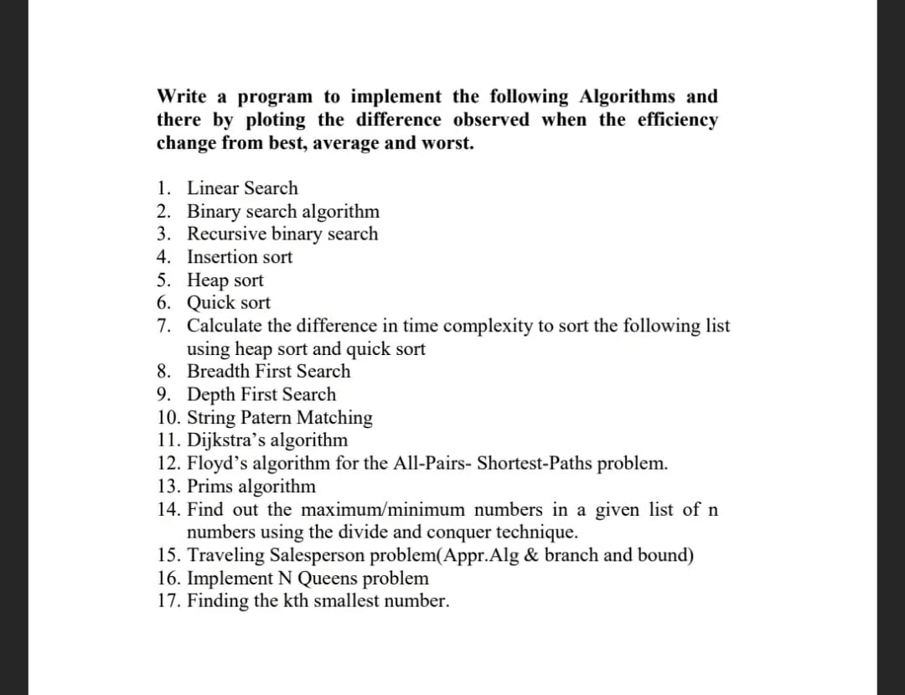

- **Reflection**
	- **If today were the last day of my life, would I want to do what I am about to do Today?**
	- **What actions that I'll do if the day is restored from the Morning 4 AM?**
	- **What have you achieved today? and others**
	- **Top Priorities**
		- DONE Problem solving (Learn/Practice/Review)
		  :LOGBOOK:
		  CLOCK: [2025-05-27 Tue 06:25:42]--[2025-05-27 Tue 06:25:44] =>  00:00:02
		  :END:
		- Push one task in Creating Solution
		- DONE Peace Mind
		  :LOGBOOK:
		  CLOCK: [2025-05-27 Tue 06:25:47]--[2025-05-27 Tue 06:25:48] =>  00:00:01
		  :END:
	- **Mood:**
		- On a scale of 1-10, how was my overall mood today?
			- [Rating]
		- What influenced my mood?
			- [Factors affecting mood]
	- **Gratitude:**
		- List three things I'm grateful for today.
			- [Gratitude 1]
			- [Gratitude 2]
			- [Gratitude 3]
- **Captures and Notes**
	- we'll learn about the proper use of HTTP methods, RESTful URI structures, effective error handling, caching strategies, and the importance of thorough API documentation.
	- Additionally, we'll present **common API anti-patterns** that often lead to bigger problems later.
	- recall the http protocal, API security
	- 
	-