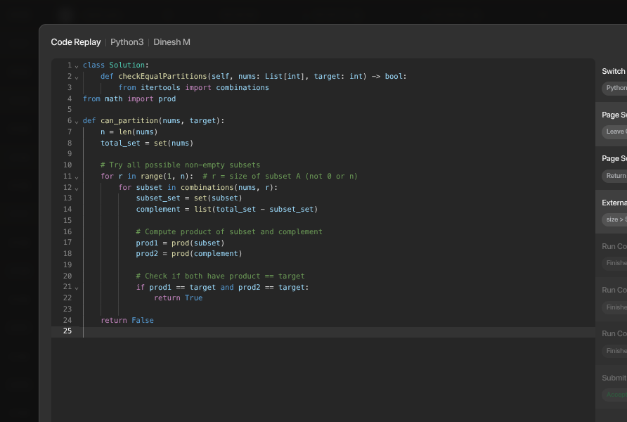
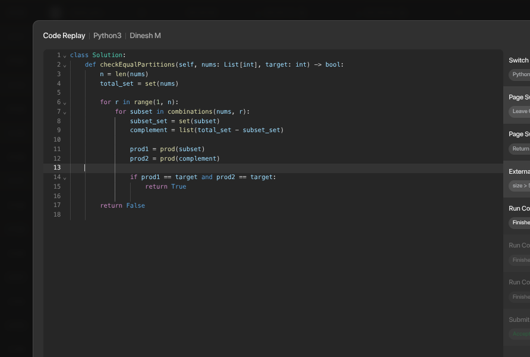
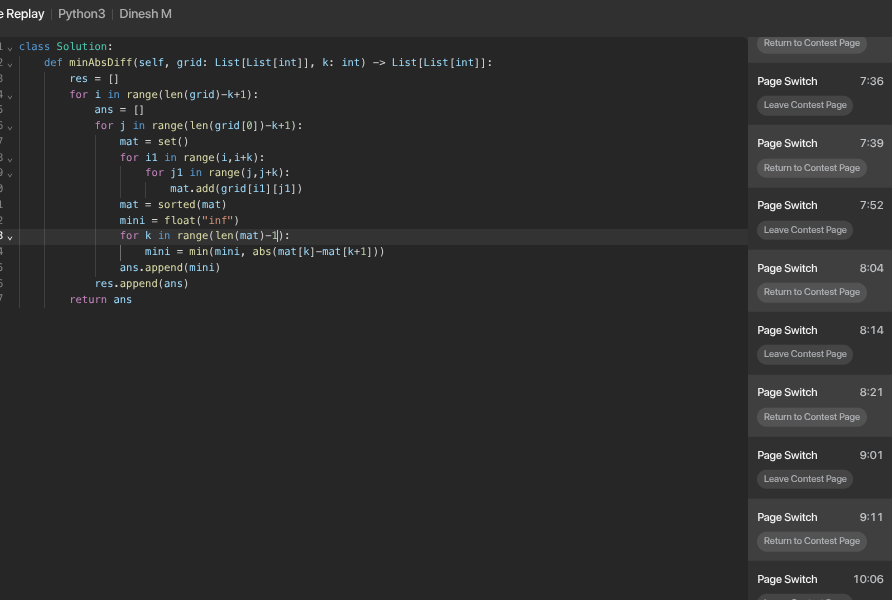
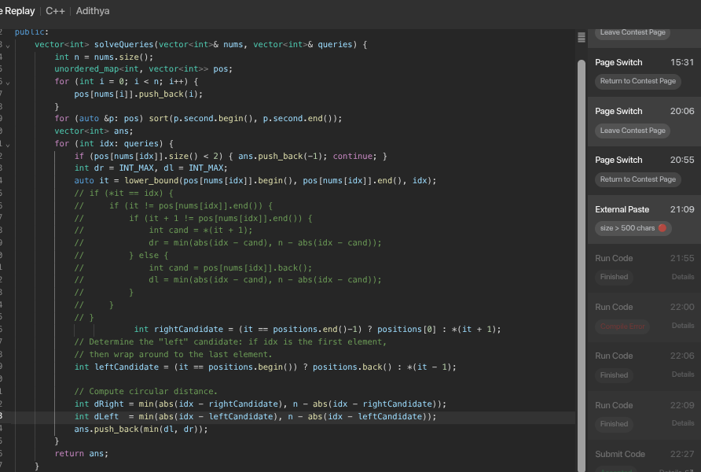

- Reflection
	- Have I definite the Today's Goal on Top Priorities and those of Close to ?
		- Solving Problem: Learn/Practice/Review
		- Push one task in Creating Solution
		- DONE Peace Mind
	- Reflection:
		- If today were the last day of my life, would I want to do what I am about to do Today?(Yes/NO)
		- **Am I taking clear, consistent actions toward a goal or milestone?** No
		- **Am I prioritizing today’s time for the right, effortful actions?** No
		- DONE **Deep Work: Am I able to stay focused on one thing for an extended period?**Yes
- **Captures and Notes**
	- [[Getting relevancy]] #Learning
	- Privacy Cheaters, waste of your time. They are all cheaters. You just need to be true to yourself. They'all not refer that mirroring/any small issues in their code. They cheat by just copy or type copy while in the contest
	  collapsed:: true
		- **Privacy Cheaters — A Waste of Your Time**
		- They are all cheaters. You just need to be true to yourself.
		- They won’t admit to mirroring or any small issues in their code.
		- They cheat by simply copying or typing copied code during the contest.
		- 
		- 
		- 
		- 
		-
	- The Only thing, I should Prioritize the right actions with my time. I do not change the Logseq to Obsidian. I need this.
	- What is the purpose of this Algorithm? e.g. *for Finite Automata - String belongs to the Language?* #Learning
	- [[Theory of Computation]]
	- Recap the anudeep's escape from tutorial hell
		-