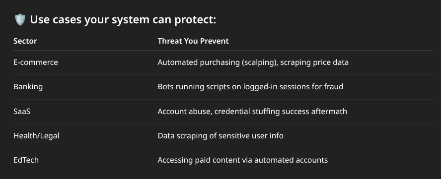

- Why should the Idea is Workable:
	- Most bot detection focuses on:
	- **Before login** (reCAPTCHA, rate limiting, IP blocks)
	- **Login abuse** (credential stuffing, brute force)
	  
	  But **post-login bot detection** is:
	- **Rare** but **critical**: because **many bots succeed at login** using stolen credentials (from breaches, phishing, etc).
	- These bots then:
		- Scrape data and creating Denial of Service.
		- Perform fraud (banking, offers)
		- Abuse API endpoints (cart abuse, ticket scalping)
		- Exfiltrate user/business data
		  
		  Your system addresses this exact risk — **active bot behavior after login**.
	- {:height 277, :width 661}
- examples
- Why does this idea, not has been implemented??
	- Your idea — detecting bots *after login* based on user behavior — is **valuable and rare**, but:
		- **Most systems wrongly trust users after login**, so they skip checks.
		- **It's hard to build** (behavior tracking, real-time analysis, no false blocks).
		- **Privacy concerns** make devs cautious.
		- **Most bot protection tools only guard login**, not what happens after.
		- **You're early** — but this is where things are heading (zero-trust, continuous validation).
- **Behavioral anomalies we found and created a multi-model with these**
	- Human users have **imperfect timing**, natural jitter.
	- Bots have:
		- Precise cursor jumps
		- Perfect typing speed
		- Zero hesitation
		- No idle time
		- Tab-switch/scroll patterns that look robotic
	- #### 2.  **Session rhythm**
		- A user browsing casually vs. bot clicking 30 pages in 5 seconds = red flag
	- #### 3.  **Device**
		- Logged in from a browser → suddenly acts like a headless script? Block.
	- #### 4.  **Invisible traps**
		- Place hidden buttons/fields. Bots might click them, users won’t.
	- #### 5.  **Challenge-response**
		- Micro challenges like “shake mouse” or random delay input — users can do, bots fail.
- we  create a SDK for a purpose enterprise as the full software were they can import and start - starter function all the task are progress thro the backend of that sdk, for each instant and it will provide prediction on human / bot as a result (0 or 1) so they just need to import and use starter()
- TASKS
	- DONE SDK
	  :LOGBOOK:
	  CLOCK: [2025-07-25 Fri 10:26:00]
	  :END:
	- DONE backend set and services
	- DONE Model training
	  :LOGBOOK:
	  CLOCK: [2025-07-25 Fri 10:26:21]
	  CLOCK: [2025-07-25 Fri 10:26:27]--[2025-07-26 Sat 11:10:50] =>  24:44:23
	  :END:
	- DONE Background running sdk
	  :LOGBOOK:
	  CLOCK: [2025-07-25 Fri 10:26:31]
	  CLOCK: [2025-07-25 Fri 10:27:16]--[2025-07-26 Sat 11:10:48] =>  24:43:32
	  :END:
- Real time - cases
- # **FraudShield AI**
- Bot fraud is evolving, routinely bypassing login defenses like stolen credentials, OTPs, and CAPTCHAs, enabling post-login attacks such as data scraping, API abuse, and fraudulent transactions, which traditional security tools fail to detect.
- # Why  **Bot Fraud ** is  **Evolving ** ?
  
  Bots are bypassing traditional login security with stolen credentials, rendering OTPs and CAPTCHAs ineffective. Once inside, they cause significant damage:
- Scrape pricing and user data, leading to **competitive disadvantages** and privacy breaches.
- **Abuse APIs** for malicious activities like cart hoarding and ticket scalping.
- Execute various forms of fraud, including **unauthorized bank transfers** and offer exploitation.
  
  Current security tools focus **"before login,"** leaving a critical vulnerability for post-login attacks.
- # **Our solution**
- #### **Behavioral Biometrics**
  
  Analyzes inter-key latency, typing rhythm, and mouse trajectories to identify human-like behavior patterns.
- #### **ML-Powered Scoring**
  
  Utilizes a RandomForestClassifier trained on 1,200+ real user sessions for robust anomaly detection.
- #### **Real-Time Prediction**
  
  Our API returns a binary result (0 for bot, 1 for human) per session in less than 1 second.
- # **Architecture Overview**
- #### **Frontend SDK (JavaScript)**
  
  The **starter()** function initiates event listeners for keystroke and mouse movements, passively capturing user interaction data.
- #### **Backend API (Python FastAPI)**
  
  Ingests the event stream, runs the RandomForest model and anomaly detectors, then sends a JSON response: **{"result": 0|1}**.
- #### **Data Store & Training**
  
  Behavioral data is synchronized via Google Sheets, locally stored as JSON, and processed with Pandas in Colab for model training.
- # **Why It Works: Filling the Post-Login Gap**
  
  Traditional security relies on pre-login measures like reCAPTCHA, rate-limiting, and OTP, creating a "trust after login" vulnerability.
  
  > 
  
  **FraudShield AI provides continuous vetting by distinguishing subtle human behaviors from robotic precision.**
- ### **Humans**
- **Jittery typing** rhythms and variable inter-key latency.
- **Natural idle pauses** and inconsistent session durations.
- **Organic mouse movements**, including natural scroll and tab patterns.
- ### **Bots**
- **Uniform latency** and precise, predictable keystroke timing.
- **Absence of idle time**, with repetitive, fixed session rhythms.
- **Mechanical mouse movements**, often with precision jumps and direct pathing.
- # **Behavioral Anomalies & Multi-Model Detection**
- #### **Precision vs. Jitter**
  
  Detects abnormal uniformity in input timing, where human interactions exhibit inherent randomness.
- #### **Session Rhythm**
  
  Identifies patterns like excessive clicks per second (e.g., 30 clicks/5s), differentiating from casual browsing.
- #### **Device Context Switch**
  
  Flags unusual transitions, such as an authenticated desktop browser session suddenly behaving like a headless script.
- #### **Invisible Traps**
  
  Leverages hidden fields or buttons; bots often click these, while legitimate users ignore them.
- #### **Micro Challenge-Response**
  
  Introduces subtle prompts (e.g., "shake mouse" or random delay input) that humans can intuitively pass, but bots fail.
- # **Features at a Glance**
- #### **<1s Prediction**
  
  Ultra-low latency for real-time bot detection without user impact.
- #### **Behavioral Analytics**
  
  Comprehensive analysis of keystroke and mouse movement patterns.
- #### **Adaptive ML**
  
  Combines RandomForestClassifier with advanced anomaly detection.
- #### **Live Data Sync**
  
  Real-time behavioral data sync to Google Sheets for continuous improvement.
- #### **Admin Alerts**
  
  Instant notifications and detailed logs for suspicious activities.
- #### **Privacy-First**
  
  Ensures no PII is stored outside the session context, prioritizing user privacy.
- # **SDK for Enterprises**
- #### **Simple Import**
  
  ```
  import fraudshield; fraudshield.starter()
  ```
  
  Integrate with just a few lines of code, minimizing development overhead.
- #### **Lightweight Listener**
  
  Collects events efficiently and sends batched data, ensuring minimal performance impact.
- #### **Stateless Operation**
  
  Unloads after prediction, maintaining a small memory footprint and preventing resource drain.
- #### **Prediction API**
  
  Returns a clear 0 (bot) or 1 (human) status, enabling immediate automated responses.
- #### **Customizable**
  
  Offers flexible threshold tuning, robust logging hooks, and customizable alert callbacks for tailored security.
- # **Use Cases & Market Fit**
  
  | E-commerce | Automated scalping, price-scraping, inventory hoarding |
  | Banking | Fraudulent scripts executing unauthorized transfers on logged-in sessions |
  | SaaS | Post-login credential stuffing, account takeovers, internal data exfiltration |
  | Health/Legal | Automated scraping of sensitive user records and confidential data |
  | EdTech | Automated accounts accessing paid content, cheating, and content redistribution |
- **Zero UX friction:** Seamless integration without impacting user experience.
- **Scalable across industries:** Adaptable solution for diverse enterprise needs.
- **Aligns with zero-trust trend:** Enhances security posture by continuously verifying user behavior.