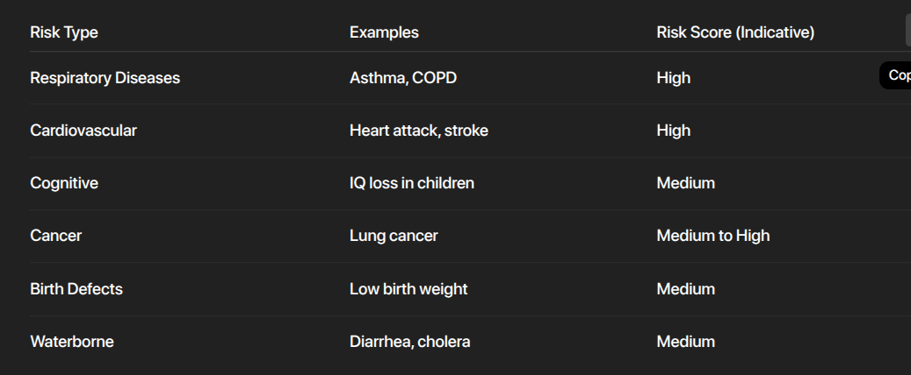
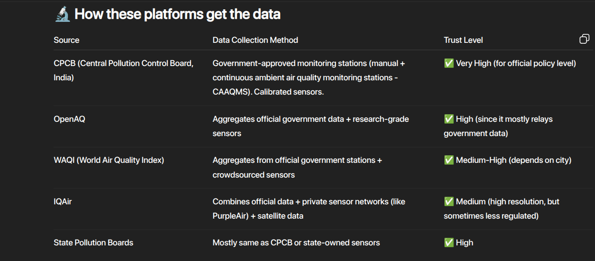
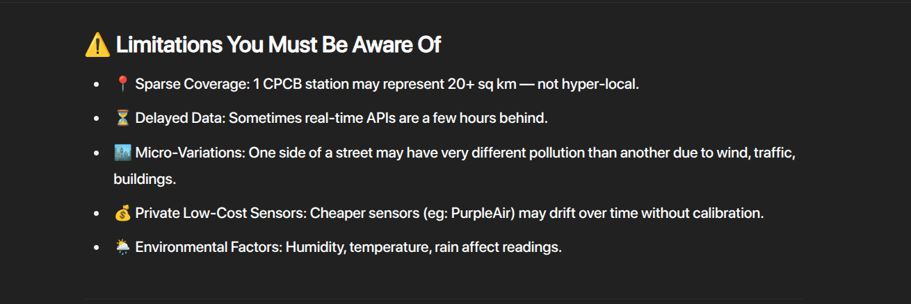
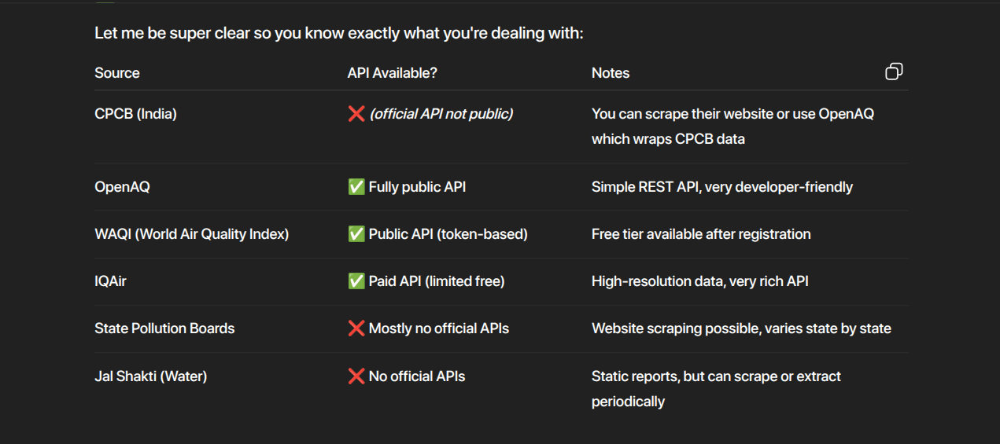
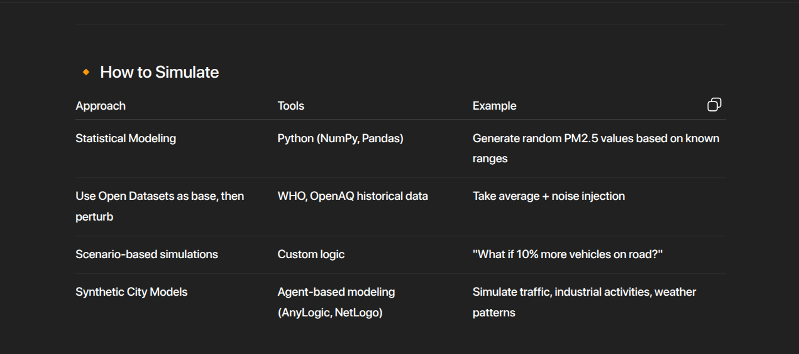
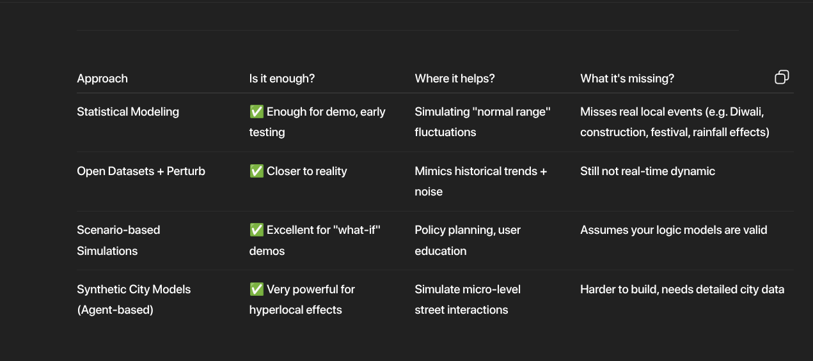
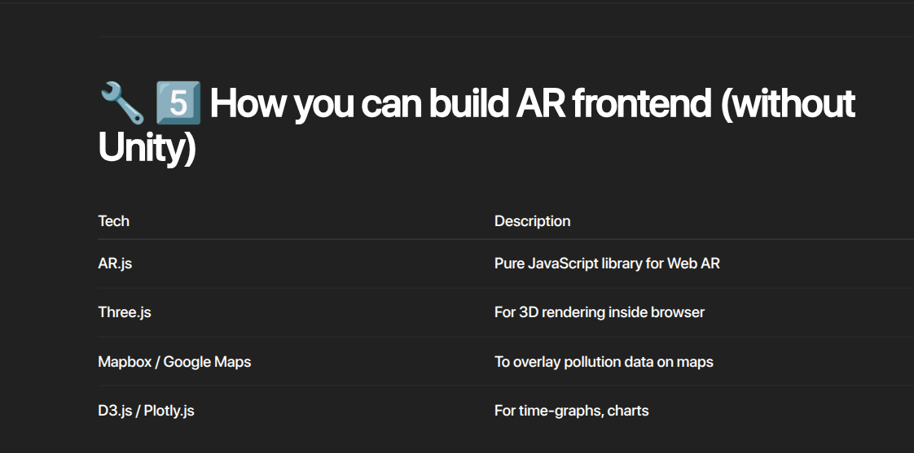
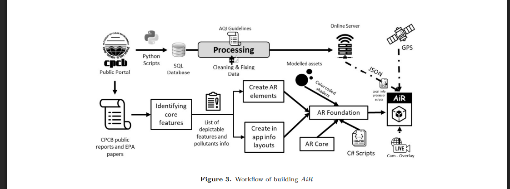

- **Statement:**
	- Despite worsening pollution in Indian cities, there's a
	  disconnect between environmental data, public awareness, and effective policy-making. Citizens lack clear insight into how pollution impacts their daily lives, while policymakers
	  struggle to act on complex data. Your challenge is to develop an AR/VR-based interactive platform that visualizes real-time exposure to air, water, and noise pollution. The system should integrate real or simulated datasets, use AI to simulate long-term human impacts (e.g., health risks from PM2.5 or waterborne diseases), and enable “What if” urban planning scenarios. It should feature tailored modes for citizens, schools, and policymakers, using goal-based storytelling and decision-driven simulations to drive education, engagement, and action.
- The Identified Problem:
	- Collecting the Environmental Data is tough
	- Public Awareness & it's consistency is hanging
	- Effective Decision making defected due to complex data (even irrelevant data gathered)
- What I have to do is, Solve these Pain killer problem from top to least.
- What I planned as an Idea:
	- Through Real or Simulated Data, passed to The AR platform
	- AR/VR - Platform
	- CORE: The first Thing.
		- Visualize the Real time Pollution (air, water, Noise) **>>>**  results to produce:
			- The Current Verdict on prevailing situation.
			- The Long term Impact (risk list and its score, list them pls)
				- {:height 280, :width 658}
			- The Right Actions minimally to do and Do NOT DO ACTIONS.
	- Secondary, after achieving the above:
		- I have to Categorize the platform into 4 section (the main that I discussed) (i should complete in the arranged order coz, I have to prioritize the work.)
			- section 2: Citizen - The report of Past to present & gather what they done, reward (kinda system)
			- section 3: Regulation Update & IMPACT RATIO (what ppolicy makers did & the impact of people following) through suggest certain & specific needy actions only to them.
			- section 4: Drive on story , Long term risks & its worst case. What can do in a least manner to do.
- **LEAD 01: Getting Data (REAL & SIMULATED)**
	- ### **Air Pollution (PM2.5, PM10, NOx, SO2, Ozone, CO)**
		- | Source | Access Method | Notes |
		  | ---- | ---- | ---- |
		  | **CPCB (Central Pollution Control Board, India)** | https://app.cpcbccr.com/AQI_India/ | Live Air Quality Index (AQI) data. Free public access. |
		  | **OpenAQ** | [https://openaq.org/](https://openaq.org/) | Free API, global coverage including Indian cities. Well-documented API. |
		  | **WAQI (World Air Quality Index)** | https://aqicn.org/data-platform/token/ | Free API key. Global data. |
		  | **IQAir** | [https://www.iqair.com/](https://www.iqair.com/) | Provides real-time air quality API with premium subscription. Free tier limited. |
		  | **State Pollution Control Boards** | State-level portals | Some states provide historical & live data. |
		  
		  ---
	- ###  **Water Pollution**
		- | Source | Access Method | Notes |
		  | ---- | ---- | ---- |
		  | **CPCB Water Quality Data** |  | Periodic water monitoring data. Limited real-time. |
		  | **Jal Shakti Ministry** |https://ejalshakti.gov.in/IMISReports/  | Rural water quality monitoring |
		  | **State Water Boards** | Local portals | Some real-time sources exist. |
	- ### **Noise Pollution**
		- | Source | Access Method | Notes |
		  | ---- | ---- | ---- |
		  | **CPCB Noise Monitoring Network** | https://ejalshakti.gov.in/IMISReports/IMISReportLogin.aspx | Noise monitoring stations available in metro cities. |
		  | **City-level smart city platforms** | e.g. Pune, Hyderabad, Bangalore Smart City | They have some live sensor data. |
	- How does these data are being accurate??
		- 
		- 
		-
	- Extract the data thro APIs & scraping
		- 
	- SIMULATING THE DATA:
		- 
		- Based on the Approaches we have to include.
		- 
		-
- LEAD 02: Main Player (Feature Engineering to get actionable data)
	- For this Data is Gathered. Now AI is the stage.
	- for the data I have to future Engineer for these below: ==*Based on the data columns extract features*==
		- to get the result as to visualize the pollution with heat map/geo map/time-graph
		- To produce the values for long term impact & what if (risk lists and scores)
		- from the above two I have to generate the right actions.
- LEAD 03: Augumented Reality (AR is **not using the camera to detect pollution**. **Instead:** The camera gives you the live visual background (reality). Your app adds virtual digital information *on top* of that camera feed based on data you already have (from sensors / APIs / AI models).)
	- **"Digital information placed on top of real-world camera view."**
	- You open camera → you still see real world → but the system overlays **extra data** like:
	- Because the Pollution is Invisible. People didn't feel the danger.
	- Front end: Three things Have to shown.
		- `Current Verdict on prevailing Situation`
		- `Long term Impact (risk list and its Score)`
		- `The Right what TO DO & DON'Ts.`
		- 
		- 
- LEAD 04:  Backend, The Amazing Conqueror.
	- Data Extraction thro APIs and webscrap, (*API services and Scrap*)
	- Simulating Data for ML
	- store the data,
	- pass to the ML model and get the result data,
	- pass to the AR Front end.
	- API Layers
	- Cross origin (connected Front end)
- SECONDARY LEAD 01:
	- Addresses the 1st one
		- Exposure History from the data extract (just piped here, with right columns)
		- Health Impact - risks list and score (the worst case)
			- What if, simulator panel for 1 - 2 days
			- If you been next period of time - the risk with percent.
		- Behavior Tracker from users & Reward systems - just to encourage consistency
	- addresses the 2nd one
		- Updates / scraped
		- Impact ratio
		- Suggested Actions for the next period of time (from the complex data to this)
- The Previous Work; `AiR`
	- 
	- What they missed:
		- They Implemented only the Air Index & Pollution. And Public Awareness
	- What we have:
		- Make people Consistent over their actions - Right Actions, report, Reward thro streak & consistency.
		- Policy Makers
			- Impact ratio on current regulations,. Suggested Actions thro Complex Data
			- The Impact of An Organization and Monitor system of them. (might be they also a coz).