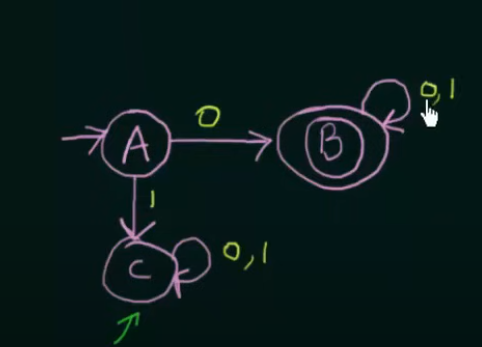
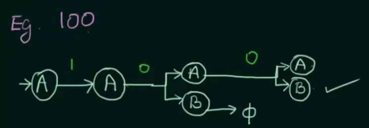
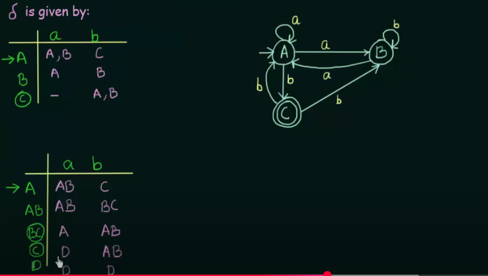
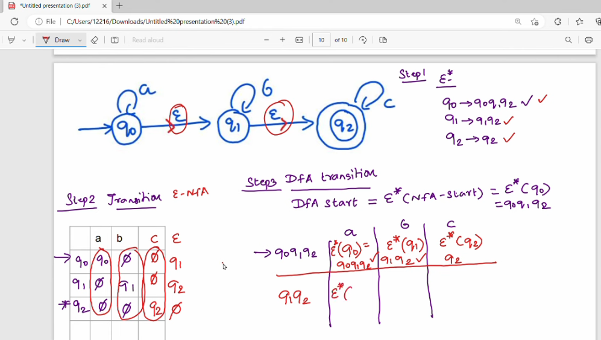
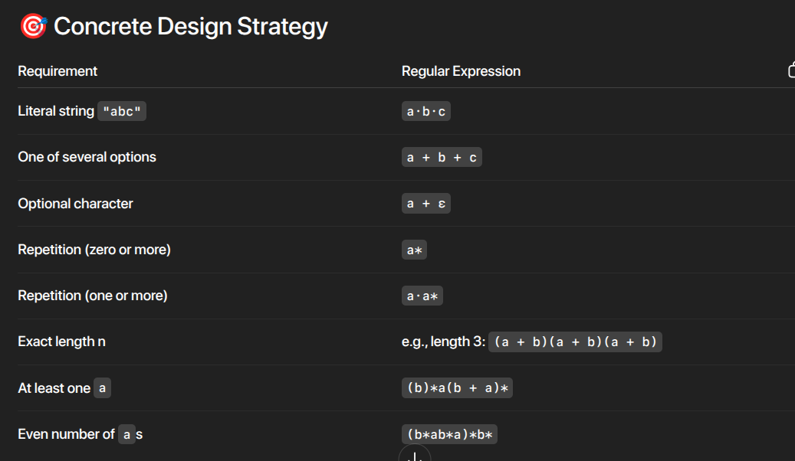
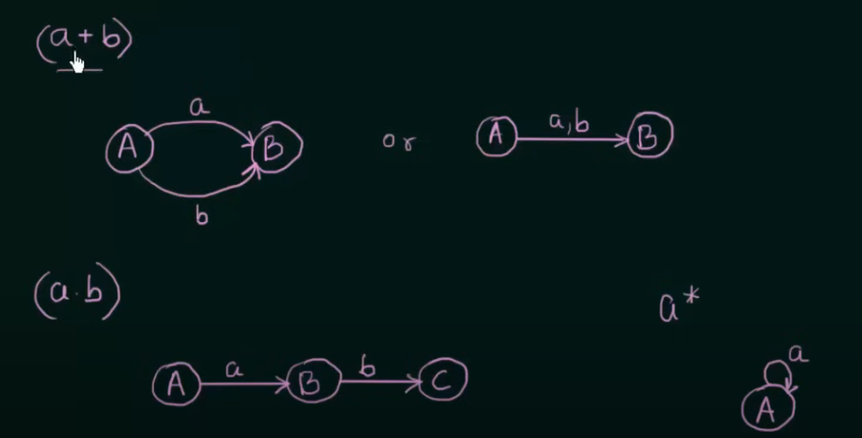
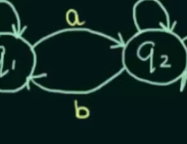
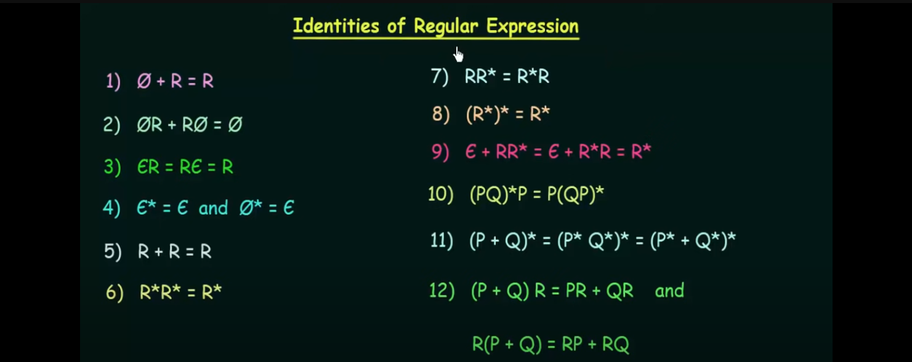
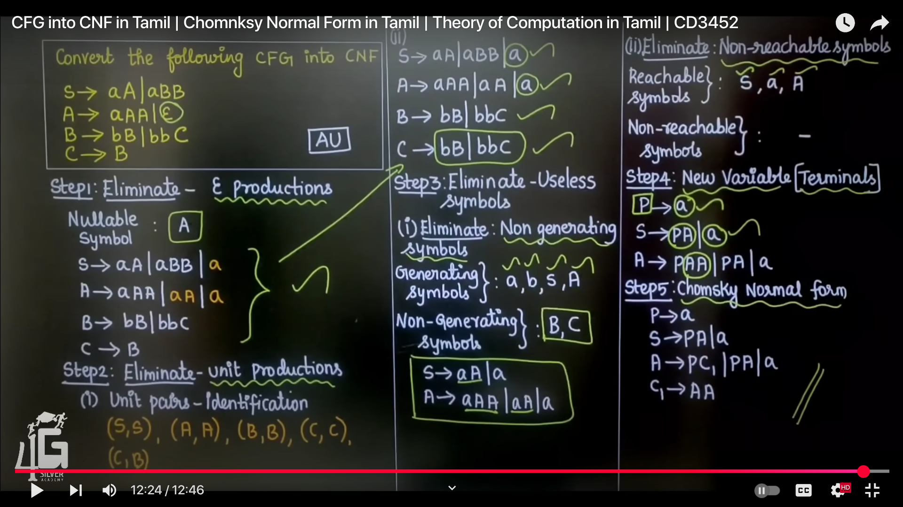
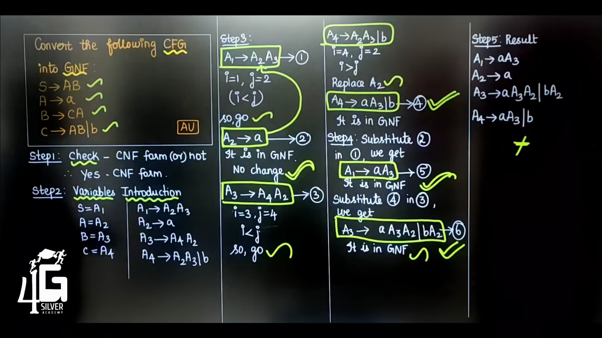

- What is a string and a language? how do they related?
- What Finite State Machine mean? How it is related to String and language?
- When to use self-loops, dead transition and restart transitions?
- What is Transition function? and what is the purpose, with by whom it providing change?
- When a state is called as Rejected?
- What is "ε" and how does it work in Machines?
- How does the accepted state done in Machines (DFA & NFA)
- What is NFA? how does it works?
- How does cycle transition simplified?
- Conversion of NFA & DFA.
  id:: 684423bc-d97a-44bf-91bf-d42038f9fd8a
-
- Chapter 01: Questions they ask
  collapsed:: true
	- Check whether the given String is in Finite Machine (DFA/NFA) by construct the given language
	- Conversion of NFA into DFA
	- Conversion of e-NFA into DFA
	- Minimization of DFA
- Chapter 01: Notes
	- if a string - a sequence of symbol is given 
	  like 01 - the language is to generalize that to denote from the sample string
	- Finite state machines - FA are used to model or express the language.
	  collapsed:: true
		- `M = (Q, Σ, δ, q₀, F)`
		  
		  the only purpose if a string (a specific seq of symbol is there) and check if that belongs to the language (which is general form of the same string)
		- Machines have finite state & Machine can be in a state to another (transit) and described through Transition Function. And transition of a machine is done by the **Inputs** that is imposed.
		- accepted state - If there is any way to run the machine that ends in any set of states out of which atleast one state is a final state, then the NFA accepts
		- The Rejected State - A state from one to another which can't reach the "Final State" at any point.
		  collapsed:: true
			- 
			- 
	- DFA - Deterministic Finite Automata
	  collapsed:: true
		- How to check:
		  collapsed:: true
			- **Define the DFA**: `M = (Q, Σ, δ, q₀, F)`
			- **Start at Initial State**: Set `current = q₀`
			- **Read the Input String** . For each symbol `a` in the string: `current = δ(current, a)`
			- **Check Final State**: If `current ∈ F` → Accept,  Else → Reject
		- Constructing point:
		  collapsed:: true
			- start to build the target string first.
			- self-loops and restart transitions - Because of the new 1 might be the start of a new 101, Still it is keeping the possibility alive of reaching the target pattern, OR Doesn't affect the current progress. Else restart  if The current input invalidates the progress, The current input invalidates the progress.
			- dead state transitions - From **each state**, for **every symbol in Σ**, there must be **one unique next state**. If no valid transition exists → create a **dead state** and transition to it.
			  
			   You **do not** need to follow where the input `0` came from (*where I thought, the same input held in that state must possess the same input from other state*). Every state (like `q2`) **must** have transitions for all input symbols (`0`, `1`). So yes, it's **mandatory** to define them
			- **`0 or 1`s is divisible/multiple by `x`:**
			  collapsed:: true
				- Track the count of `0`s modulo `x` using states.
				- When the count of `0`s reaches a multiple of `x`, the DFA transitions back to the initial state.
			- string and substring.
	- NFA - Non - Deterministic finite Automata
	  collapsed:: true
		- **NFA** – From a state, for a given input, it can move to **one or more states**, possibly **in parallel**.
		- ε - epsilon
		  collapsed:: true
			- "Can I treat ε as if **nothing has been read** yet (""), and use it just to **move to the next state** without consuming input?"
			  Yes — **ε means: No input symbol is consumed**. It's **just a state transition** to keep moving in the machine
			  
			  Whenever a No symbol consumption is needed epsilon is used.
			- Use cases:
			  collapsed:: true
				- You want to allow optional substrings.
				- You want to join multiple paths. (`L = L1 ∪ L2 ∪ L3`)
				- Concatenation and Kleene Star / Repetition.
		- Construction point: how to create a cycle or simplify it to (0, 1) *its input
		  collapsed:: true
			- In an NFA, a **cycle with branching** occurs when a state has a transition on an input symbol back to itself (forming a loop) **and** also transitions to other states on the same input. This lets the NFA nondeterministically either stay in the cycle to process more input or move to another state (like a final state) to accept the string.
			- In an NFA, suppose I have a transition: `a` (on input 0 or 1) → `b` (final state, reached when input is 1). Now, if I have a string like `"11"`, I can design it like this: `a` → `a` (on input 1), then → `b` (on input 1). Or, simultaneously, if `a` goes to `b` directly on 1, it still reaches the final state. It's like a cycle, right?So whenever I have a cycle like this, I can do this:
			  
			  `a` (on input 0 or 1) moves to itself, and on input 1, it can also move to `b` (final state, possibly).
		- how to check
		  collapsed:: true
			- ``N = (Q, Σ, δ, q₀, F) δ: Q × (Σ ∪ {ε}) → 𝒫(Q)``
			- currentStates = ε-closure({q₀})
			- For each symbol a:
			  collapsed:: true
				- current = δ(current, a)	For each symbol a:
				- • For each s ∈ currentStates, compute δ(s, a)
				- • Union all results → nextStates
				- • currentStates = ε-closure(nextStates)
			- If currentStates ∩ F ≠ ∅ → Accept
	- Conversion of NFA into DFA:
	  collapsed:: true
		- **Define the dead state** – for inputs that don't lead anywhere in DFA.
		- collapsed:: true
		  
		  Use **union** for combining states:
			- First, **draw the NFA transition table**.
			- If an NFA state has **multiple transitions for the same input**, **combine those** into one **DFA state** (as a set).
			  collapsed:: true
				- 
		- A **combined DFA state** is **final** if **any of its NFA states** is final.
		- For each **combined state**, the **next state** for a given input is:  The **union of the next states** of each NFA state in that combination (with corresponding input). In the next state,  if we reach one w/ pi before. consider it's next dead state as null rather create other dead state
		- initial - all state, and for each stage of state, reduced level wise. on e-closure. When DFA begins from `q0`, we actually **start** from all of these states in NFA, because ε lets us go there freely before reading any input!
		- ε-closure - All states you can reach from a given state using only ε (epsilon) transitions — including the state itself. YES — **ε-closure is first applied to the initial state** in NFA when converting to DFA.
		  collapsed:: true
			- list the ε-closure.
			- transition diagram for the ε-NFA
			- for that ε-closure states, ε*(each state in that closure order i.e. q0q1q2 - a(q0), b(q1), c(q3).)
			- 
			-
	- Minimization of DFA
	  collapsed:: true
		- Draw the transition table for that DFA
		- Equivalence 0: {set of non-final states}, {set of final states}
		- Equivalence 1: For each group, split states into separate sets if, for any input symbol, their transitions lead to different groups
		- Equivalence 2: If two consecutive iterations yield the same partition, then stop
		-
		- points to remember:
		  collapsed:: true
			- check all the partition and get the valid state. Then partition. E.g. 
			  `A, B, C` here `AB` is invalid for some condition. so I need to check the `AC` before separating them. ==> {`A, C`} {`B`}
			- In Transition Diagram, `AC`, `C` points to the `C`, then in the new DFA, `AC` points to *itself*
- Design a Regular Expression for language:
	- Define the Language
	- Union of each instance
	  e.g. `L = {e, a, b, aa, bb, ab, ba}` =>`e + a + b + aa + bb + ab + ba`
	- For each seek the pattern from `repetition`, `union` (making options/optional-s), `conc`.
	- 
	-
	-
- Conversion of Regular Expression to FA:
  collapsed:: true
	- 
	- 
	  collapsed:: true
		- which is `(ab)*`
- Conversion of FA to Regular Expression (Arden Theorem):
  collapsed:: true
	- Use all incoming transitions to write equations
	- If the final state's equation can be solved with only itself (via Arden), that's the regex
	- If not, solve other states and substitute back
	- -- If Multiple states - find for all states and `UNION` them
	- Arden Theorem
	  collapsed:: true
		- `R = Q + R·P`
		  Then:
		  `R = Q·P*`
		  **Condition**: P **must not contain ε**
- **Regular Expression Identities**  (often used  *with*  Arden's):
  card-last-score:: 3
  card-repeats:: 1
  card-next-schedule:: 2025-05-28T20:48:16.694Z
  card-last-interval:: 4.14
  id:: 682d29f8-f197-40f0-b929-99675edca9b5
  card-ease-factor:: 2.36
  card-last-reviewed:: 2025-05-24T17:48:16.695Z
  collapsed:: true
	- 
- 
- Chapter 3: Questions they Ask
  collapsed:: true
	- Check whether the given symbol belongs to PDA by constructing given language
	  collapsed:: true
		- Left Derivation - apply production to the left most variable
		- Right Derivation - apply production to the right most variable
	- PDA by constructing given context-free language
	  collapsed:: true
		- There should Not be any Pop operation needed
- Check whether the given string belongs to the Context Free Grammar:
  collapsed:: true
	- Start with the `Start symbol` and choose the closest production rule that `matches with the given string`
	- Replace the Variable with its most Appropriate Production and repeat until the string or production stops.
- Create Context free Grammar - production rule patterns:
  collapsed:: true
	- {:height 423, :width 748}
- Pushdown Automata:
  collapsed:: true
	- Construction of Pushdown Automata:
	  collapsed:: true
		- Production Rules: in `RHS`-- `(new_state, the_string_replaces_CURRENT_TOP)`
		  collapsed:: true
			- Works on `CURRENT_TOP_REPLACEMENT`
			- Destruction: `e-> pop TOP & push NOTHING`
			- Construction: `INPUT, TOP -> INPUT&TOP`
			- Null: `INPUT, TOP -> TOP`
		- PDA transition diagram
		- Notation: `Q, E, q0, F, td, Z0, GAMMA`
	- Matching
	  collapsed:: true
		- Uses the `TRANSITION(STATE, INPUTS, STACK_SYMBOLS)`
		-
- CFG - CNF and GNF
  collapsed:: true
	- 
	- 
	-